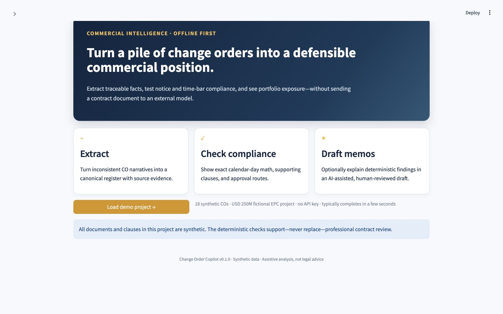
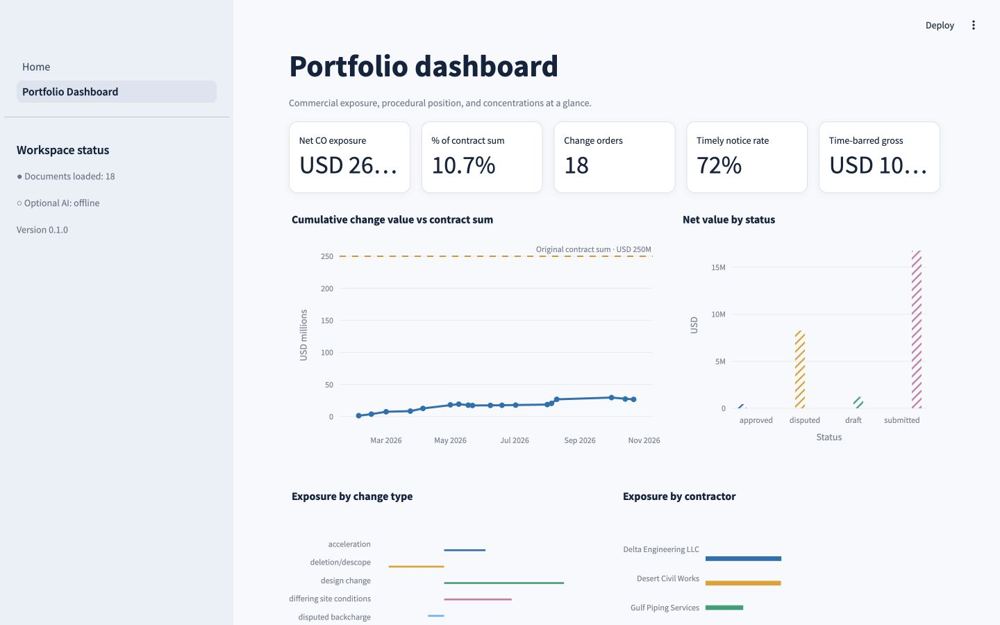
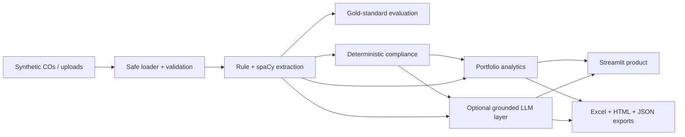

# Change Order Copilot

[](https://github.com/Rajvik85/change-order-copilot/actions/workflows/ci.yml)
[](https://www.python.org/)
[](LICENSE)
[](docs/NLP_LLM_METHODOLOGY.md)

**Turn a pile of change orders into a defensible commercial position.**

Change Order Copilot is an offline-first internal product prototype for
structured change-order extraction, contractual compliance checks, and
portfolio exposure analytics. Its deterministic core works without an API key.
An optional, clearly separated LLM layer can draft grounded summaries and
review memos, but it never changes a compliance verdict.





> **Important:** This is an assistive portfolio prototype, not legal or
> contractual advice. All project data, documents, people, companies, and
> clauses are synthetic and invented.

## Why this project exists

Commercial teams often have the facts they need, but those facts are scattered
across inconsistent notices, estimates, schedules, and clause citations. This
project turns those documents into an auditable register, then answers the
questions a contracts manager asks first:

- Was notice served within the contractual period?
- Do the cited clauses support this type of change?
- Which values need higher approval authority?
- Where is exposure concentrated, disputed, or procedurally vulnerable?
- Can every extracted number be traced back to its source sentence?

It is the commercial member of a project-controls AI trilogy:
[cost forecasting](https://github.com/Rajvik85/evm-intelligence) +
[schedule risk](https://github.com/Rajvik85/schedule-risk-ml) +
commercial intelligence.

## Product journey

| Screen | Review purpose | Screenshot status |
|---|---|---|
| Home | Load the complete offline demo | Captured above |
| Document Intake | Upload, paste, map, and validate inputs | Capture for v1.0.0 |
| Portfolio Dashboard | See exposure, compliance, and concentrations | Captured above |
| CO Analysis | Trace facts to source spans and inspect exact date math | Capture for v1.0.0 |
| Compliance Checker | Review the CO × check matrix and time-bar radar | Capture for v1.0.0 |
| AI Review Memo | Compare the designed no-key state and grounded example | Capture both states for v1.0.0 |

**Demo GIF placeholder:** record about 20 seconds at 1440×900: open Home, click
**Load demo project**, open **Portfolio Dashboard**, select a time-barred CO in
**CO Analysis**, and reveal its exact notice-day calculation. Keep the pointer
movement slow enough for hiring reviewers to follow the “money path.”

## Architecture



The LLM receives canonical extracted facts and only the relevant invented
clause text. It explains deterministic results; it cannot override them.

## Quickstart — fully offline

Python 3.11–3.13 is supported.

```bash
python3.11 -m venv .venv
source .venv/bin/activate
pip install -r requirements.txt
pip install -e .
streamlit run app/Home.py
```

Open the local URL and choose **Load demo project**. The 18-document demo is
designed to cold-start in under 60 seconds on a normal laptop.

Run the deterministic pipeline and evaluation without the UI:

```bash
python run.py --split held_out
```

## Optional LLM setup

The core does not need a key. To enable memo drafting, install one or both
optional providers and set a key only through the environment:

```bash
pip install -e ".[llm]"
cp .env.example .env
```

Leave unused entries blank. `.env` and key files are excluded from Git.

## Extraction evaluation

The 18 authored documents were labeled before extractor implementation. Twelve
form the development set; six remain the declared held-out evaluation set.
Numbers and dates use exact match, clause references use normalized set match,
and type uses exact classification accuracy.

| Held-out field | Precision | Recall | F1 |
|---|---:|---:|---:|
| CO type | 1.000 | 1.000 | 1.000 |
| Cost value | 1.000 | 1.000 | 1.000 |
| Schedule days | 1.000 | 1.000 | 1.000 |
| Clause references | 1.000 | 1.000 | 1.000 |
| Notice date | 1.000 | 1.000 | 1.000 |
| Event date | 1.000 | 1.000 | 1.000 |
| Status | 1.000 | 1.000 | 1.000 |
| **Micro overall** | **1.000** | **1.000** | **1.000** |

This is a deliberately constrained synthetic benchmark, not evidence of
production accuracy. The methodology document records failure modes and avoids
generalizing beyond the corpus. CI enforces an overall F1 floor of 0.90.

## Docker

```bash
docker build -t change-order-copilot .
docker run --rm -p 8501:8501 change-order-copilot
```

Open `http://localhost:8501`.

## Deploy to Streamlit Community Cloud

1. Push this repository to GitHub.
2. In Streamlit Community Cloud choose **Create app**.
3. Select the repository, branch, and `app/Home.py` entry point.
4. Use Python 3.11 and deploy without secrets for the offline demo.
5. Add `OPENAI_API_KEY` or `ANTHROPIC_API_KEY` in Streamlit secrets only if the
   optional memo layer is required.

The app makes no session writes to repository files. Uploads are validated,
session artifacts use isolated temporary folders, snapshots and exports are
atomic, and cache keys include input plus configuration hashes.

## Repository guide

- `data/` — 18 synthetic COs, 15 invented clauses, metadata, and gold labels.
- `src/co_copilot/` — typed offline engines, optional LLM layer, and exports.
- `app/` — multi-page Streamlit internal product.
- `tests/` — robustness, hand-verified date math, extraction floor, and UI smoke tests.
- `docs/` — domain, architecture, methodology, UI, canonical schema, and interview preparation.

## NOTICE

Developed independently as personal portfolio work on personal equipment;
contains no employer-derived material, code, templates, or data; all datasets
and documents are synthetic.

## Roadmap

- PDF ingestion, page-aware spans, and OCR quality scoring.
- Configurable FIDIC-style *concept* libraries using licensed or client-owned text.
- Human-reviewed production benchmark with inter-annotator agreement.
- Enterprise document connectors and identity-aware access controls.

## License

[MIT](LICENSE)
