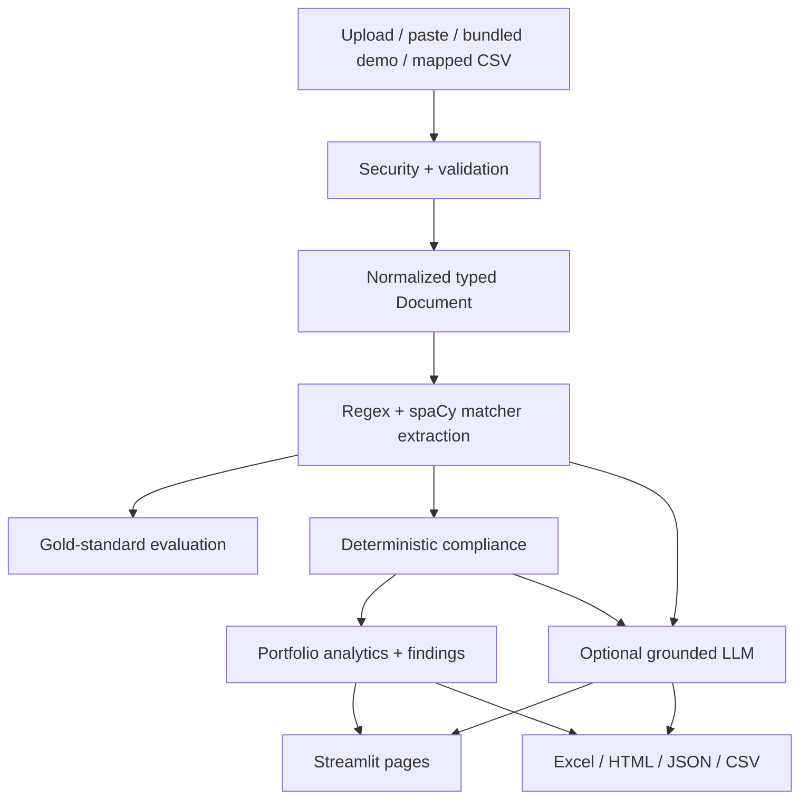

# System Notes

## Data flow

## Module responsibilities

- `document_loader.py` reads `.md`, `.txt`, and `.docx`, normalizes Unicode and
  whitespace, detects sections, and degrades to full-text mode with a warning.
- `extractor.py` owns commercial regexes, date/currency parsing, clause
  normalization, keyword scoring, and spaCy NER/matcher signals.
- `evaluation.py` compares canonical output with immutable hand labels.
- `compliance.py` owns date arithmetic, clause support, approval routing, and
  transparent checklist evidence.
- `analytics.py` creates the canonical register, aggregates exposure, and emits
  commercially reasoned findings.
- `mapping.py` translates variable client headers into the canonical schema.
- `pipeline.py` orchestrates bounded work and returns partial provisional
  results on timeout or cancellation.
- `storage.py` writes isolated session snapshots atomically and creates the
  page-level escape-hatch ZIP.
- `report_export.py` creates a formatted Excel register and self-contained HTML.
- `prompts.py` is the inspectable prompt-engineering artifact.
- `llm_layer.py` contains the provider protocol, optional adapters, grounding,
  timeouts, retries, and typed result states.

## Why rules, not a trained model

Eighteen synthetic documents are an evaluation fixture, not a defensible
training corpus. Training on them would measure memorization and introduce a
randomness burden without improving the dominant tasks: labeled dates,
commercial numbers, clause references, and deterministic deadlines.

The honest rigor is:

1. author documents;
2. label them;
3. freeze a 12/6 development/held-out split;
4. implement deterministic extraction;
5. report exact per-field metrics and error modes; and
6. enforce the 0.90 micro-F1 floor in CI.

## Why compliance is never delegated

A notice verdict is reproducible date math against configured rules. Sending
that decision to a generative model would add variance, weaken auditability,
and make regression testing harder. The optional model receives the fixed
verdict and explains it.

## Why the LLM sees structured facts

Raw-document prompting expands the hallucination surface and makes it difficult
to prove which values were supplied. The grounding payload contains:

- canonical field values;
- deterministic checklist results;
- the fixed time-bar verdict;
- cited clauses; and
- the synthetic notice/time-bar clauses.

The UI shows the payload. Missing facts use a prescribed phrase. Output remains
labeled for human review.

## Resilience and multi-user safety

- Repository files are read-only at runtime.
- Each browser session receives an unguessable 32-character ID.
- Uploads, mapping profiles, and snapshots are confined to that session's
  system-temporary folder.
- Safe JSON—not pickle—is used for recovery.
- Atomic writes use a sibling temporary file, flush, `fsync`, and `os.replace`.
- Every page exposes a ZIP containing all computed facts and checks.
- Content and configuration hashes key the demo cache and stamp exports.
- Upload extension, MIME hint, filename, count, and size are validated before
  parsing.
- A 45-second pipeline budget and 500-document ceiling return a provisional
  subset instead of hanging.

Streamlit cannot process a new click while one synchronous script run is
executing. Cancellation is therefore supported at pipeline boundaries through
a callback; the UI reports per-document progress and preserves completed work.
True interactive mid-call cancellation would require a background job queue.

## Performance envelope

Tested on an Apple laptop with Python 3.11:

| Workload | Observed behavior |
|---|---|
| 18 demo COs, matcher fallback | Under 1 second after process warm-up |
| Full test suite, 44 tests | About 3 seconds warm |
| Community Cloud hosted demo | 0.53 seconds after cold start completed |
| App dependency cold start | Under 60 seconds on Python 3.11 |
| Guardrail | 500 documents or 45 seconds, then provisional result |

Extraction loops by document because trace spans are inherently document-local.
Portfolio aggregation uses pandas vectorized grouping and cumulative sums.
Charts receive an already-aggregated register. No quadratic pairwise document
operation exists in the interactive path.

## Configuration reference

| Section | Purpose |
|---|---|
| `extraction` | confidence threshold, F1 floor, text/model limits |
| `compliance` | notice and particulars periods, value authorities, concentration |
| `uploads` | file size/count/type policy |
| `performance` | time and document ceilings |
| `llm` | provider models, request timeout, bounded exponential retry |
| `ui` | chart height and colorblind-safe categorical palette |

Project-specific dates and approval thresholds live in
`data/project_meta.yaml`; application guardrails live in `config.yaml`.

## Limitations

- The benchmark is synthetic, regular, English-only, and intentionally small.
- PDF/OCR and page-coordinate spans are not implemented.
- Date ambiguity is reported by the parser but requires user confirmation in a
  production intake workflow.
- Clause support is a configuration mapping, not legal interpretation.
- Schedule days are exposure indicators, not a delay analysis.
- Recovery is session-scoped and temp-volume persistence depends on the host.
- Optional model quality is spot-checked, not statistically benchmarked here.

## Windows compatibility

All paths use `pathlib`; no path separator is hard-coded. Atomic replace,
temporary directories, pandas, openpyxl, python-docx, and Streamlit are
cross-platform. CI runs Linux; the code targets Python 3.11–3.13.
